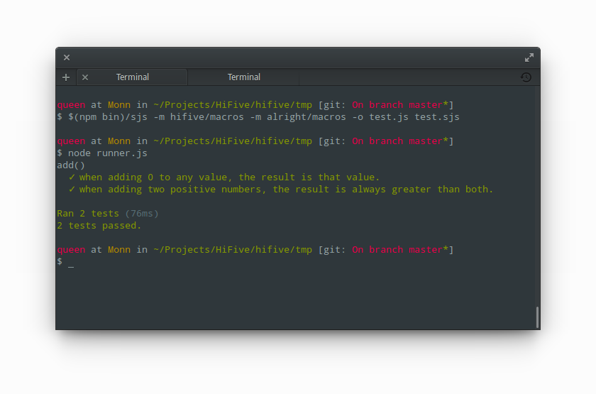

Getting started
===============

Prerequisites
-------------

This page will guide you through all the things you need to do to start writing
tests with Hi-Five on Node, and Browsers (the instructions should be similar to
other platforms). It assumes that you'll be using Sweet.js macros for writing
the tests, as well as the `alright`_ assertion library.

.. _alright: https://github.com/hifivejs/alright

Installing Hi-Five
------------------

Make sure you've got both `Node.js`_ and ``npm`` installed, and follow the
instructions for your platform:

Hi-Five on Node.js
''''''''''''''''''

1) Install `Sweet.js`_:

.. code-block:: sh

       $ npm install sweet.js@0.7.x

2) Install `hifive`_, the `alright`_ assertion library, and the `spec reporter`_:

.. code-block:: sh

       $ npm install hifive alright hifive-spec

.. _Node.js: http://nodejs.org/
.. _hifive: https://github.com/hifivejs/hifive
.. _spec reporter: https://github.com/hifivejs/hifive-spec
.. _sweet.js: http://sweetjs.org/

Hi-Five on the Browser
''''''''''''''''''''''

1) Install `Sweet.js`_:

.. code-block:: sh

       $ npm install sweet.js@0.7.x

2) Install `browserify`_:

.. code-block:: sh

       $ npm install browserify

3) Install `hifive`_, the `alright`_ assertion library, and the `spec reporter`_:

.. code-block:: sh

       $ npm install hifive alright hifive-spec

.. _browserify: http://browserify.org/

Writing tests
-------------

The idiomatic way of writing tests in Hi-Five is fairly similar to `Mocha`_'s,
but the macros reduce some of the boilerplate. Basically, you organise your
tests into suites (groups of tests) and definitions (a group of one or more
assertions related to a particular functionality).

As an example, let's consider the following function::

    // add.js
    function add(a, b) {
      return b === 0?         a
      :      /* otherwise */  add(a + 1, b - 1)
    }

    module.exports = add

We can then provide some tests for this function::

    // test.sjs
    var add = require('./add');

    module.exports = spec 'add()' {
      it 'when adding 0 to any value, the result is that value.' {
        add(4, 0) => 4;
        add(0, 5) => 5;
      }

      it 'when adding two positive numbers, the result is always greater than both.' {
        add(4, 5) => 9;
        add(3, 2) => 5;
      }
    }

As you see, one can create new groupings of tests using the macro ``spec
<description> { <tests...> }``, and can provide a definition with the ``it
<description> { <javascript statements...> }`` macro. The assertions themselves
are written here using `alright`_'s ``<expression> => <expected value>`` macro,
but since Hi-Five allows you to use any assertion library, you could do this
using Node's ``assert`` library::

    var add    = require('./add');
    var assert = require('assert');

    module.exports = spec 'add()' {
      it 'when adding 0 to any value, the result is that value.' {
        assert.strictEqual(add(4, 0), 4);
        assert.strictEqual(add(0, 5), 5);
      }

      it 'when adding two positive numbers, the result is always greater than both.' {
        assert.strictEqual(add(4, 5), 9);
        assert.strictEqual(add(3, 2), 5);
      }
    }

In either case, the result of evaluating the ``spec`` macro is a ``Suite``
object, that describes all the tests that belong to that suite. Since this is
just a regular data structure, no tests get ran unless we explicitly tell
Hi-Five which ones we want to run.

.. note::

   Both ``Suite`` (the object created by the ``spec`` macro) and ``Case`` (the
   object created by the ``it`` and ``async`` macros) are first-class data
   structures, and can be manipulated in the same way Strings and other values
   are. This makes it simple to abstract over Hi-Five and programmatically
   generate tests.

.. _Mocha: http://visionmedia.github.io/mocha/

Asynchronous tests
''''''''''''''''''

Hi-Five has built-in support for asynchronous tests, the only thing you need to
do is return a ``data.future`` instance from the ``async`` macro::

    var Future = require('data.future');

    spec 'Asynchronous tests' {
      async 'Passes after 1 second.' {
        return new Future(function(reject, resolve) {
          setTimeout(resolve, 1000)
        })
      }

      async 'Fails after 1 second.' {
        return new Future(function(reject, resolve) {
          setTimeout(reject, 1000)
        })
      }
    }

Running tests
-------------

To run a test you need to write a runner using the Hi-Five library. In most
cases, this is what you want::

    // runner.js
    // First we load in the Hi-Five library, which has the methods to run tests.
    var hifive   = require('hifive');

    // Then we load the reporter which will present the results of running the
    // test in some human or machine-readable way.
    var reporter = require('hifive-spec')();

    // Then we load the tests we want to run.
    var suites   = [ require('./test') ];

    // And finally we pass the tests to the runner, alongside the reporter.
    hifive.runWithDefaults(suites, reporter);

    
Since we're using Sweet.js macros, you'll need to compile the tests using
Sweet.js before running them:

.. code-block:: sh
    
    $ $(npm bin)/sjs --module hifive/macros --module alright/macros --output test.js test.sjs

Running on the command line
'''''''''''''''''''''''''''
    
And finally just run it through Node:

.. code-block:: sh

    $ node runner.js

Running on the Browser
''''''''''''''''''''''
           
To run it in the browser you'll need to compile the ``runner.js`` file with
`Browserify`_:

.. code-block:: sh

    $ $(npm bin)/browserify runner.js > browser-runner.js

And add it to a web page:

.. code-block:: html

   <!DOCTYPE html>
   <html>
     <head>
       <title>Hi-Five tests</title>
     </head>
     <body>
       
     </body>
   </html>
